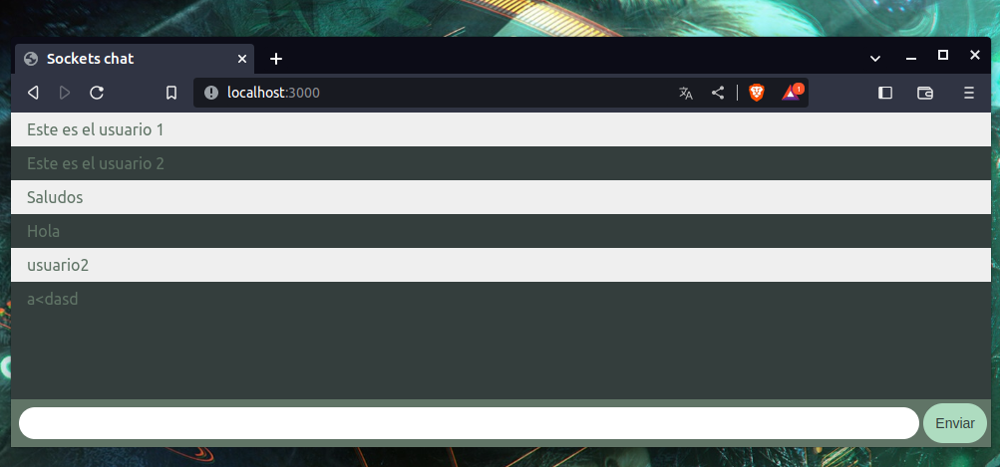
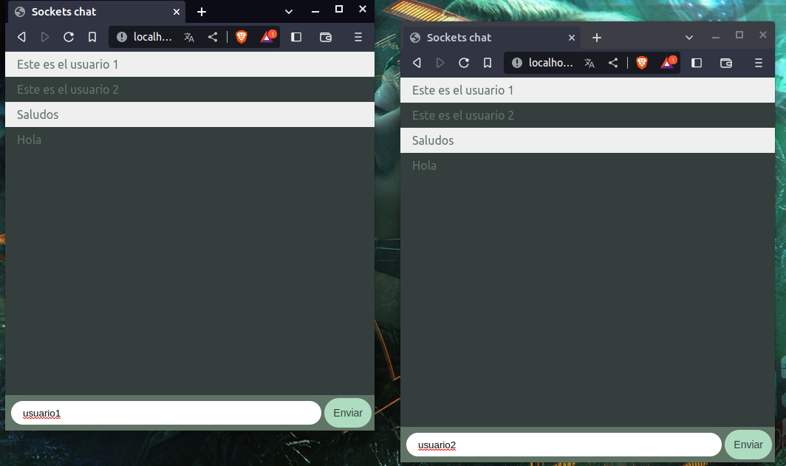

## Chat Sockets



### Descripción
Un chat de tiempo real usando sockets con el modulo npm "socket.io".
Este ejemplo fue hecho con NodeJS y Express.

<div align="center">


</div>

## Instrucciones
Ejecuta el comando para descargar las dependencias: 

```
npm install
```
Ejecuta en la terminal para testear el proyecto

```
npm run test
```

<div align = "center">



</div>